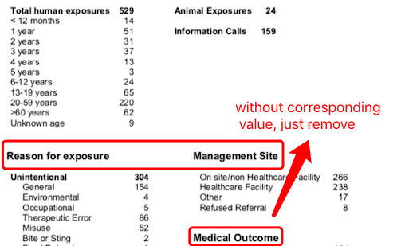

```{r setup, include=FALSE}
knitr::opts_chunk$set(echo = TRUE, message = FALSE,
                      warning = FALSE)
```
# Motivation 

In this case study, the goal is to read in the data from the first page of PDF reports, which gives exposure counts for calls to the [Maryland Poison Center](https://www.mdpoison.com/). Finally we would like to create a tidy and clean dataset of calls to the Maryland Poison Center (MPC) based on reports form 2006 to 2008 of all counties(totally 312 files). Here is a brief introduction of it.

<div align="center">
<iframe width="560" height="315" src="https://www.youtube.com/embed/ylW3sy8CStc" frameborder="0" allow="accelerometer; autoplay; encrypted-media; gyroscope; picture-in-picture" allowfullscreen>
</iframe>
</div>

<center>
[source: https://www.youtube.com/watch?time_continue=10&v=ylW3sy8CStc]
</center>


In previous open case studies, we have dealt with reading data from excel, csv or sas. There is a special format we have not tried---PDF, which have tremendous adoption rates and became ubiquitous in today’s work environment. Their ability to be viewed from a broad range of environments makes them especially appealing for exchanging important data. For example, many hedge funds try to create value from mining of news and various official filings, thus it is important to extract key information and update their investment method. Also, a vast amount of new information related to government policy appears constantly, with immediate impact on our life. Monitoring such information in real time is important for government organization but out of reach of the individual.  


But it is always hard to extract data from pdfs and convert them to a neat excel or csv format. Why? First, pdfs are scanned in files and don't contain any 'selectable' text. While those documents are easily readable for humans, computers are not capable to understand the scanned image text. Of course you could do the simple copy and paste, but this would become time-consuming when you need to deal with hundreds or even thousands of pdfs. In addition, after reading PDFs, what you would get will be plenty of strings, which usually contain unstructured or semi-structured data. Therefore, it is necessary to learn the basics of how string works. 

In this case study, we will focus on how to extract data from pdf documents provided by Maryland Poison Center, using the R package `pdftools`, and transform the original messy form into a tidy csv with package `stringr`.

The libraries used in this study are listed in the following table, 
along with their purpose in this particular case study:

|Library|Purpose|
|---|-------------------------------------------------------------------------------------------|
|`kableExtra`|Helps with building common complex tables and manipulating table styles; creates nice-looking HTML tables|
|`tidyverse`|A coherent system of packages for data manipulation, exploration and visualization |
|`pdftools`| Text extraction, rendering and converting of PDF documents|
|`stringr`|A consistent, simple and easy to use set of wrappers for common string operations|


In order to run this code please ensure you have these packages installed. 

```{r packages}
library(tidyverse)
library(dplyr)
library(pdftools)
library(purrr)
library(stringr)
```

The learning objectives for this case study include:

  * extract data from pdf files
  * string manipulation

# What is the data? 

All data files are provided by [the Maryland Poison Center (MPC)](https://www.mdpoison.com/), which aims to decrease the cost and complexity of poisoning and overdose care while maintaining and improving patient outcomes.
 
Annual reports about calls to the MPC can be accessed from [this page](https://www.mdpoison.com/factsandreports/), which include information for all states and individual counties. We would like to focus on the individual counties and they all have the same format like this:

<center>

</center>


Here was our plan:

* Download  all 312 county pdf files (24 counties by 13 years) for 2006-2018. 
* Write a function to extract data from any pdf document with this structure (all MPC county reports have this same structure from 2006-2018). To show what I would like to get more clearly, a sample document (Allegany County 2018) is used as example.
* Test this function on two additional counties (Prince George’s County, Talbot County) for 2018; update function as needed.
* Attempt to extract data from all 312 pdfs, modifying the function as needed to handle any errors.
* Clean the resulting data set with regular expression.

# Data import

Call reports from all 24 Maryland county equivalents for the years of 2006 - 2018 need to be downloaded. A sample pdf document can be found [here](https://www.mdpoison.com/media/SOP/mdpoisoncom/factsandreports/reports/countypdf2018/Allegany%20County%20Statistical%20Report%202018.pdf)

The general link looks like this:
https://www.mdpoison.com/media/SOP/mdpoisoncom/factsandreports/reports/countypdf**year**/**County%20Name%20**Statistical%20Report%20**year**.pdf

where **County%20Name%20** is the name of the county with %20 as spaces and **year** is the year of the data.  County names with punctuation (periods, apostrophes) drop the punctuation in the link name. 

We can go back through 2006; reports prior to 2006 have a different format so we will skip them for now.  

The 2016 links are a little bit different:
https://www.mdpoison.com/media/SOP/mdpoisoncom/factsandreports/reports/**county-pdf-2016**/Allegany%20County%20Statistical%20Report%202016.pdf

so will have to account for that:

```{r createLinks}
countyNames <- c("Allegany County", "Anne Arundel County", "Baltimore City", "Baltimore County", "Calvert County", "Caroline County", "Carroll County", "Cecil County", "Charles County", "Dorchester County", "Frederick County", "Garrett County", "Harford County", "Howard County", "Kent County", "Montgomery County", "Prince Georges County", "Queen Annes County", "Somerset County", "St Marys County", "Talbot County", "Washington County", "Wicomico County", "Worcester County")
years <- 2006:2018
```

Now we create all of the links for each county/year combination:
```{r}
links <- NULL
files <- NULL
for (i in years) {
  for (j in countyNames) {
    countyNameForLink <- paste(unlist(strsplit(j, " ")), collapse="%20")
    if (i != 2016) {
      tempLink <- paste0("https://www.mdpoison.com/media/SOP/mdpoisoncom/factsandreports/reports/countypdf",i,"/",countyNameForLink,"%20Statistical%20Report%20",i,".pdf")} else {
      tempLink <- paste0("https://www.mdpoison.com/media/SOP/mdpoisoncom/factsandreports/reports/county-pdf-",i,"/",countyNameForLink,"%20Statistical%20Report%20",i,".pdf")}
    tempFile <- paste0(j," Statistical Report ", i,".pdf")
    links <- c(links, tempLink)
    files <- c(files, tempFile)
  }
}
```

Download and save documents in a `data` subfolder. Remember to create this subfolder first:

```{r downloadDocuments, eval=FALSE}
for (i in 1:length(links)) {
  download.file(links[i], paste0("./data/",files[i]))
}
```

```{r include=FALSE}
files = list.files(path='./data',pattern="*.pdf")
```
Nest, "Allegany County Statistical Report 2018.pdf" will be used as an example to show each wrangling step.

# Data wrangling 

<center>

</center>


## Step 1: Read and Extract 

In order to read data from pdf, we will use function [pdf_data()](https://www.rdocumentation.org/packages/pdftools/versions/2.2/topics/pdftools). This function will return one data frame per page, containing one row for each texbox in the PDF so we can extraxt information from the first page.

```{r}
read <- function(pdf.file){
  # read in the pdf document; select the first page 
  pdfData <- pdf_data(pdf.file)
  p1Data <- pdfData[[1]] 
  return(p1Data)

}

evfile <- "Allegany County Statistical Report 2018.pdf"
evdf <- read(evfile)
```

<center>

</center>
 
We can see that this function splits the individual words. "x" and "y" are the corresponding column and row value respectively so it is pretty easy for us to manipulate with them! Now we would try to group words in the same row together with `group_by()`.

Function [arrange()](https://www.rdocumentation.org/packages/dplyr/versions/0.7.8/topics/arrange) is helpful when we would like to arrange rows by sorting variables in an descending order. 'by_group = TRUE' will sort first by grouping variable. Year information is easy to get since it is list as the first element in the dataframe and we only need to transfer it as numeric data. Considering the county, have a look on the pdf snapshot, the full county name is listed in the same row. Therefore we decide to paste text in the same row together and extract it. Try on test file first!

```{r}
evdf_line <- evdf %>% group_by(y) %>%
  arrange(x, .by_group=TRUE)%>% 
  summarize(line = paste(text, collapse=" "))

head(evdf_line)
```

The second line is what we would like to get - full county name. Then we convert above step into function `ex()`

```{r}
ex <- function(p1Data){
   # get the year and country from the header
  p1Data <- p1Data %>% group_by(y) %>%
  arrange(x, .by_group=TRUE)
    
  year <- p1Data$text[1] %>% as.numeric()
  
  county <- p1Data %>% 
  summarize(line = paste(text, collapse=" ")) %>%
  slice(2) %>% select(line) %>% as.character()
  
  return(list(county, year))
}


evdf_ex <- ex(evdf)

evdf_ex
```

## Step 2&3: Slice & Split

The first few lines of text don’t contain any data, but do contain the year and county for the document. After extracting year and county, the second step is to slice out the header part. Our strategy is to find the where "calls" appear at the first time, that's why I use min() to get its row value. Then just keep rows with larger value than it.

We still have the problem of the fact that there are really two columns worth of data on this page of the pdf, which is reflected in row 5 of this line data frame:

```{r}
evdf_line[5,]
```

If we look at the original file:

<center>

</center>

To split the data into two groups by column, we need to find the minimum column value for the right part and any text with smaller column value will be seen as the left column.

```{r eval=FALSE}
evdf %>% group_by(x) %>% 
  arrange(y, .by_group=TRUE) 
```

<center>

</center>

The end of the first column is at x=258 and the begining of the right column is at x=266 so we would set x=265 as the threshold to designate left/right column. Above step will be wrote as function `mod()`.

```{r}
mod <- function(p1Data){
  
  y.cut <- min(p1Data$y[p1Data$text=="Calls"])
  
  p1Data <- p1Data %>% filter(y > y.cut + 1)%>%
   mutate(column=ifelse(x < 265, "Left", "Right"))
  # create the column variable (Left/Right)
  return(p1Data)
}
```

```{r}
evdf_mod <- mod(evdf)
head(evdf_mod)
```

## Step 4: Collapse line within column

Now, we want to collapse lines within a column by first grouping by column, then grouping by y and collapsing across x. This is just repeat what we did when extracting full county name:

```{r}
evdf_line2 <- evdf_mod %>% 
  group_by(column,y) %>% 
  arrange(x, .by_group=TRUE) %>%
  summarize(line = paste(text, collapse=" "))

head(evdf_line2)
```

The problem is that we don't think we actually want to collapse across all words in a row, because the last text value is the count of observations in that category. To achieve it, the last text piece is kept as the variable’s value and the previous pieces is used to make up the variable’s name. Suppose there is only one text piece, leave it as name.

```{r}
evdf_gp <- evdf_mod%>% 
    group_by(column,y) %>% 
    arrange(x, .by_group=TRUE) %>%
    mutate(type = ifelse(x==max(x) & x==min(x), "name", 
                         ifelse(x==max(x), "value", "name"))) 


evdf_gp[1:10,]
```

Once these pieces were labelled appropriately, we can collapse across the values of the variable’s name to get both the variable itself and the count for that variable. Still, function `paste()` is helpful to merge things of the same row together:

```{r}
evdf_cd <- evdf_gp%>% 
      summarize(variable = paste(text[type=="name"], collapse=" "), 
              count = ifelse(is_empty(text[type=="value"])==FALSE, 
                           text[type=="value"],"0"))

evdf_cd[1:10,]
```

Finally, there are some lines that are just text and not variables/counts and they can be directly removed, like “Reason for exposure”.

<center>

</center>

Similiarly, write all above as function `gp()`.

```{r update gp}
gp <- function(p1Data){

  gd <- p1Data %>% 
    group_by(column,y) %>% 
    arrange(x, .by_group=TRUE) %>%
    mutate(type = ifelse(x==max(x) & x==min(x), "name", 
                         ifelse(x==max(x), "value", "name"))) 
  
    cd <- gd %>% 
      summarize(variable = paste(text[type=="name"], collapse=" "), 
              count = ifelse(is_empty(text[type=="value"])==FALSE, 
                           text[type=="value"],"0")) %>%
    filter(count != "Calls", count!="exposure", count!="Site",
           count!="Outcome",count!="Center",variable!="Maryland")
  
  return(cd)
  
}
```

Then just combine this dataframe with information for year and county as a row-like dataframe:

```{r}
comb <- function(data, year, county){
  # create the data frame for this county/date
  myRow <- as.data.frame(t(as.numeric(gsub(",","",data$count))))
  names(myRow) <- data$variable
  
  myRow$Year <- year
  myRow$County <- county
  return(myRow)
}
```

Now to make this into a function that is given the pdf file and returns the row of data:

```{r, warning=FALSE}

fna_1 <- function(file){
  p1Data <- read(file)
  county <- ex(p1Data)[[1]]
  year <- ex(p1Data)[[2]]
  
  d <- mod(p1Data)
  d <- gp(d)
  d <- comb(d, year, county)
  return(d)
}

```


Great! Let's test on this file and another two additional files:

```{r eval=FALSE}
fna_1("Prince Georges County Statistical Report 2018.pdf")
fna_1("Allegany County Statistical Report 2018.pdf")
fna_1("Talbot County Statistical Report 2018.pdf")
```

<center>

</center>

There isn't any problem for our wrangling function, which is good! And for each file, `fna_1()` returns a dataframe with size 1*45. Then we can try it on all files and merged all output into one dataframe:

```{r}
d1 <- fna_1(paste0("./data/",files[1]))
D1 <- d1

options(warn=2)
for (i in 2:length(files)) {
  di <- fna_1(paste0("./data/",files[i]))
  D1 <- bind_rows(D1,di)
}
```

The final dataset we could get contains `r nrow(D1)` rows and `r ncol(D1)` columns.

## Step 5: Specify Category 

One thing we notice is that there are actually some sub-categories and we definitely wish to have MORE additional columns, and some of the sub-columns are now labeled with NA instead of the appropriate subcategory.

<center>

</center>


Like the plot above, "Reason for exposure" contains 3 sub-categories: Unintentional, Intentional and Other. We would like to specify records below them, to achieve this goal, we could update our group function:

The higher categories are:
Left column:
Total human exposures to Reason for exposure, give subcategory "Age:"
Unintentional to Intentional, give subcategory "RFE-Unintent:"
Intentional to Other, give subcategory "RFE-Intent:"
Other to end, give subcategory "RFE-Other:"

Right column: 
Management Site to Medical Outcome, give subcategory "MS"
Medical outcome to end, give subcategory "MO"


```{r update gp 2}

gp_update <- function(p1Data){
  # group the data by column and height on the page
# keep the last entry of that column/height as the value
# assign the remaining entries for that column/height the name
  gd <- p1Data %>% 
    group_by(column,y) %>% 
    arrange(x, .by_group=TRUE) %>%
    mutate(type = ifelse(x==max(x) & x==min(x), "name", 
                         ifelse(x==max(x), "value", "name"))) 
  
    cd <- gd %>% 
      summarize(variable = paste(text[type=="name"], collapse=" "), 
                count=ifelse(is_empty(text[type=="value"])==FALSE, 
                             text[type=="value"],"0"), xmin=min(x))
      
 
y.age.min <- cd$y[cd$variable=="Total human exposures"]
y.age.max <- cd$y[cd$variable=="Reason for"]
y.un.min <- cd$y[cd$variable=="Unintentional"]
y.un.max <- cd$y[cd$variable=="Intentional"]
y.int.min <- cd$y[cd$variable=="Intentional"]

x.min <- cd$xmin[cd$variable=="Total human exposures"]

y.int.max <- cd$y[cd$column=="Left" & cd$variable=="Other" & cd$xmin==x.min]
y.other.min <- cd$y[cd$column=="Left" & cd$variable=="Other" & cd$xmin==x.min]

y.ms.min <- cd$y[cd$variable=="Management"]
y.ms.max <- cd$y[cd$variable=="Medical"]
y.mo.min <- cd$y[cd$variable=="Medical"]

cd <- cd %>%
  mutate(variableSub=ifelse(column=="Left" & y > y.age.min & y < y.age.max, "Age:",
         ifelse(column=="Left" & y > y.un.min & y < y.un.max, "ReasonUn:",
         ifelse(column=="Left" & y > y.int.min & y < y.int.max, "ReasonInt:",
         ifelse(column=="Left" & y > y.other.min, "ReasonOther:",
         ifelse(column=="Right" & y > y.ms.min & y < y.ms.max, "MS:",
         ifelse(column=="Right" & y > y.mo.min, "MO:", "")))))))     
      
    
cd <- cd %>%
  filter(count != "Calls", count!="exposure", count!="Site",
           count!="Outcome",count!="Center",variable!="Maryland") %>%
  mutate(name=paste0(variableSub, variable))
  
  return(cd)
}

comb <- function(data, year, county){
  # create the data frame for this county/date
  myRow <- as.data.frame(t(as.numeric(gsub(",","",data$count))))
  names(myRow) <- data$name
  
  myRow$Year <- year
  myRow$County <- county
  return(myRow)
}

```

With the updated function, we still need to update the final function:

```{r}
fna_2 <- function(file){
  p1Data <- read(file)
  county <- ex(p1Data)[[1]]
  year <- ex(p1Data)[[2]]
  d_mod <- mod(p1Data)
  d_gp <- gp_update(d_mod)
  d <- comb(d_gp, year, county)
  return(d)
}
```

Now, let's try our new function on the pdf files to see if it works well:

```{r}
d1 <- fna_2(paste0("./data/",files[1]))
D2 <- d1

options(warn=2)
for (i in 2:length(files)) {
  di <- fna_2(paste0("./data/",files[i]))
  D2 <- bind_rows(D2,di)
}
```

Here, the size of the final dataset becomes `r nrow(D1)` rwos and `r ncol(D1)` columns, which is different from the result when we apply function fna_1. To be specific, there are MORE additional columns. To get an ideal dataset, next important step is variable cleaning.


## Step 6: Variable Cleaning

Before cleaning them, let's check what variables do we have now:

```{r eval=FALSE}
colnames(D2)
```


<center>

</center>

There are 6 subcategories which we defined before, and it is clear that there are some problems for each subcategory. The first problem is repeated sub-category, like "Age". This is because for different couties, the same subcategory may include different vairbles, so such kind of variables don't have complete information for all counties; Moreover, unknow information exists in each subcategory but it has different forms, leading to the problem that we get unnecessarily additional columns. 

In the followning part, I will deal the whole dataframe for each subcategory. Since the type of all variable names are string, **regular expression (regexp)** would be a powelful tool. Strings always contain unstructured or semi-structured data, and regexp is considered as a concise language for describing pattern strings. In thi case study, we would like to focus on matching patterns with regexp.


### Regexp Introduction

Function [`str_detect()`](https://www.rdocumentation.org/packages/stringr/versions/1.4.0/topics/str_detect). It is useful to determine if a character vector matches a pattern, and returns a logical vector the same length as the input. 

```{r}
x <- c("apple", "banana", "tomato", "mint", "lemon")
str_detect(x, "e")
```

In this example, for `x`, we would like to find if its string elements contain the word "e", so the result for the first (apple) and fifth (lemon) element is TRUE while for others is FALSE. If we want to subset these two elements, just run the following code:

```{r}
x[str_detect(x, "e")]
```


To prepare you for perfomring the matching procedue, common patterns are introduced here:


```{r}
ex_re = c("Abc", "aabc", "a abc", "abcd", "abbbCde", "acd", "aBcD")
ex_re
```

`^` and `$` finds any string that starts with and ends with certain characters respectively:

```{r}
ex_re[str_detect(ex_re,"^A")]
ex_re[str_detect(ex_re,"e$")]
```

Parentheses `()` create a capturing group with value "Cde", and `.` matches any character:

```{r}
ex_re[str_detect(ex_re, ".(Cde)")]
```

If we want to find strings that have "a" followed by "a" or "B",  `()` means capturing group and `|` means OR operand so we could write:

```{r}
ex_re[str_detect(ex_re, "a(a|B)")]
```

`+` means one or more, if we want to find strings that have "a" followed by one or more "b"

```{r}
ex_re[str_detect(ex_re, "^ab+")]
```


You can also use the combination to generate complex matches. For example, `.+` matches any character one or more times.

Let's try then! The following code is to find string start with "a" and end with "d" or "D", but we don't care about the middle part:

```{r}
ex_re[str_detect(ex_re, "^a.+(d$|D$)")]
```


Considering we have to find different patterns to match the variables that needed to be dealt with, let's define a general function to find colnames with certain pattern with function. Just like the example, first get a logical vector, and then use this vector to extract variables needed.

```{r}
str.dt <- function(pattern){
  x.bool <- str_detect(colnames(D2),pattern)
  x <- colnames(D2)[x.bool]
  return(x)
}
```


### Age

Let's check all variables of Age sub-category:

```{r}
str.dt("Age:")
```

One variable called "Age:<60 years" is pretty wried since it covers lots of other variables. Therefore let's look which observation contain this information:

```{r}
idx <- is.na(D2[str.dt("Age:<60")])
D2[idx==FALSE,c("Age:>60 years","County","Year")]
```

Only Caroline county includes this information and it has no value for "Age:>60 years" which is a common variable for all counties. Thus, we believe "<60" is a typo and it should be ">60" instead.


Then, we find there are Unknow adult, Unknown Adult, Adult, 20-, >60, <60 (typo), it is easy to extact them and check the corresponding summary with the following code:

```{r}
temp_age <- c(str.dt("Age:(Ad|20-|>60|<60)"),str.dt(".(Adu|adu)"))
summary(D2[temp_age])
```


All of them have a large proportion of NA's. This is because when MPC collected information, it may use different variables to represent the same kind of information. Just like Caroline county, it has information in "<60" but only has NA in ">60". So we decide to sum all their values as a new vairble "Age:>20 years":

```{r}
D2$`Age:>20 years`= rowSums(D2[temp_age],na.rm = TRUE, dims=1)
summary(D2$`Age:>20 years`)
```

`na.rm = TRUE` calculates the sum of the non-NA values in these variables and `dim = 1` tells R to sum over column rather than row.

The new variable has no NA's. Done for the Age part!

### RFE-Unintent

First let's check variables in RFE-Unintent sub-category:

```{r}
str.dt("ReasonUn:")
tempun <- D2[c(str.dt("ReasonUn:"),"County","Year")]
```

Do you notice there are actually repeated information for two variables, "Bite or sting" and "Bite and Sting", "Food Poisoning" and "Food poisoning". The only difference is the upper-case and lower-case but they represent the same thing so use new variables to store their values:

```{r}
str.dt(".(Poi|poi)")
D2$`ReasonUn:Botulism`= rowSums(D2[str.dt(".(Poi|poi)")],na.rm = TRUE, dims=1)
str.dt(".(or Sti|or sti)")
D2$`ReasonUn:Bite/Sting`= rowSums(D2[str.dt(".(or Sti|or sti)")],na.rm = TRUE, dims=1)
```

One thing you should be very careful is how to create the new variable. Since all of the variables we dealt with will be dropped, so do pay attention the new variable has different pattern from these old variables.  


### RFE-Other

Look at variables for RFE-Other sub-category:

```{r}
str.dt("ReasonOther:")
```

One major problem is repeated information for unknow information but we would deal with it in later steps together with all sub-categories.


Another problem is still the upper-case and lower-case difference, so we could dealt with it similiarly. Also
putting space after "/" in new variable as "/ " is intend to avoid deleting the new one in later step:

```{r}
str.dt(".(/Tamp|/tamp).")
D2$`ReasonOther:Contamination/ Tampering`= rowSums(D2[str.dt(".(/Tamp|/tamp).")],na.rm = TRUE, dims=1)
```

### RFE-Intent, MS and MO 

For RFE-Intent, MS and MO sub-category, there are no additional problems except unknow information.

```{r}
str.dt("ReasonInt:")
str.dt("MS:")
str.dt("MO:")
```

### Unknown Information

As we mentioned over and over, one common probelm for each subcategory is multiple similiar variables to represent unknown information, we would like to sum all values in "Unknown" or "Other", and create a new 
" Unknown All" column to store the sum value, here we leave a space for the same reason: avoid to create same pattern

```{r}
D2$`Age: Unknown All`= rowSums(D2[str.dt("^Age.+(ge|wn|ld)$")],na.rm = TRUE, dims=1)
D2$`ReasonUn: Unknown All`= rowSums(D2[str.dt("ReasonUn:(Unk|Oth)")],na.rm = TRUE, dims=1)
D2$`ReasonOther: Unknown All`= rowSums(D2[str.dt("ReasonOther:(Unk|Oth)")],na.rm = TRUE, dims=1)
D2$`MS: Unknown All`= rowSums(D2[str.dt("MS:(Unk|Oth)")],na.rm = TRUE, dims=1)


c(str.dt("^Age.+(ge|wn|ld)$"),str.dt("ReasonUn:(Unk|Oth)"),str.dt("ReasonOther:(Unk|Oth)"),
  str.dt("MS:(Unk|Oth)"))

```

### Additional Step

There are actually 2 wired variables 'Medical','ReasonUn:Outcome', which only has one value;

```{r}
summary(D2[c('Medical','ReasonUn:Outcome')])
```

 for "Calvert County, MD, 2017". This is caused by wired format of original pdf, just delete it
 
```{r}
idx <- is.na(D2[c('Medical','ReasonUn:Outcome')])

D2[idx==FALSE,c("County","Year")]
```

```{r}
table(idx)["FALSE"]
#idx
```


In all, we make change on 32 variables and now let's drop all old variables and save into a new dataframe
```{r}
drops <- c(str.dt(".(Adu|adu)"), str.dt("Age:(Ad|20-|>60|<60)"),
           str.dt(".(Poi|poi)"), str.dt(".(or Sti|or sti)"), 
           str.dt(".(/Tamp|/tamp)."), str.dt("^Age.+(ge|wn|ld)$"),
           str.dt("ReasonUn:Unk"), str.dt("ReasonOther:(Unk|Oth)"),
           str.dt("MS:(Unk|Oth)"),"Medical",'ReasonUn:Outcome')

Df <- D2[ , !(names(D2) %in% drops)]
#sort(names(Df))
```


# Exploratory data analysis

# Data analysis 

# Summary of results


